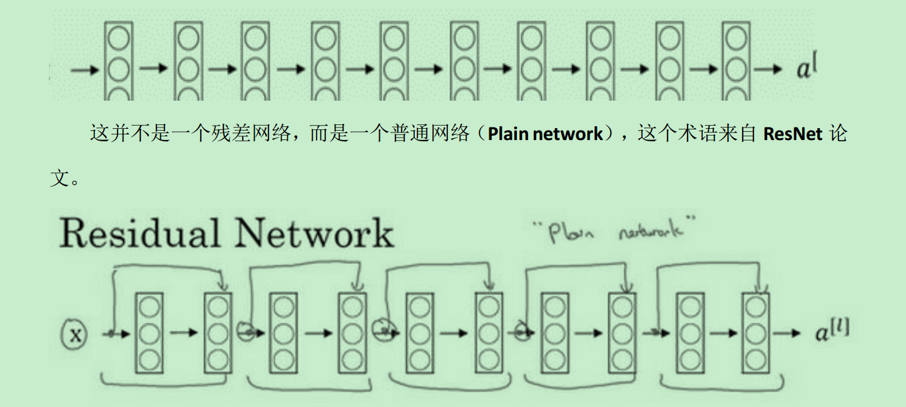

# ResNets work 残差神经网络

## 残差块
### 基本神经网络的残差块
>残差块由两层神经网络构成

假定输入层为$a^{[l]}$,第一层神经网络通过L层进行线性函数进行运算：$Z^{[l+1]}=W^{[l+1]}a^{[l]}+b^{[l+1]}$, 然后进行第一层的ReLU激活，得到：$a^{[l+1]}=g(Z^{[l+1]})$, 然后再进行第二层运算得到$Z^{[l+2]}=W^{[l+2]}a^{[l+1]}+b^{[l+2]}$，此时，仍然进行ReLU激活运算$\color{fuchsia}{a^{[l+1]}=g(Z^{[l+1]})}$. 基本神经网络第一层和第二层**算法一致**

### 残差神经网络的残差块
残差神经网络的残差块与基本神经网络的残差块基本一致，**但是，第二层的激活函数不同** $\color{red}{a^{[l+1]}=g(Z^{[l+1]}+a^{[l]})}$

> 残差神经网络可以使得$a^{[l]}$的信息直达网络深层，网络进行了跳跃连接。

> 没有残差的普通神经网络，随着网络深度的加深，训练的错误会先减少，然后增多。 深度越深意味着优化算法越难训练