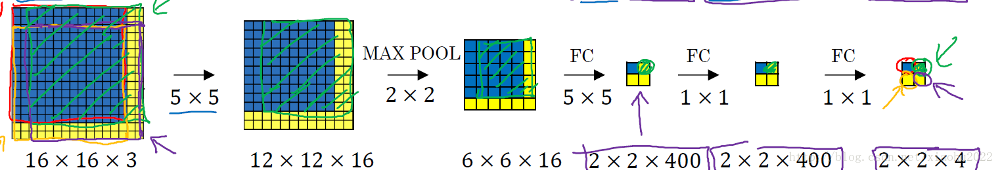

# YOLO算法

## 滑动卷积算法

https://blog.csdn.net/xiaohu2022/article/details/79211732/

在一张图像上使用滑动窗口，结合卷积神经网络的方式获取最终结果。
普通的卷积神经网络最后两层一般都是全连接层，然后使用softmax算法进行归一化。
但是滑动窗口的卷积算法中，最后的全连接层变成了卷积层。

>我们可以认为这个$2*2*400$ 是通过400个$5*5*16$的卷积实现的。因此，全连接层就变成了卷积运算。这主要是利用了卷积的一个性质**图片的空间位置信息的不变性，尽管卷积过程中图片大小减少，但是位置对应关系还是保存的**

**面尽管可以减少滑动窗口的计算量，但是只是针对一个固定大小与步长的窗口，这是远远不够的。Yolo算法很好的解决了这个问题，它不再是窗口滑动了，而是直接将原始图片分割成互不重合的小方块，然后通过卷积最后生产这样大小的特征图**