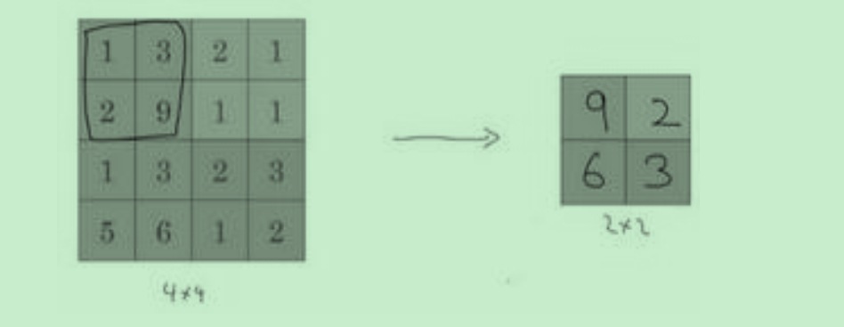
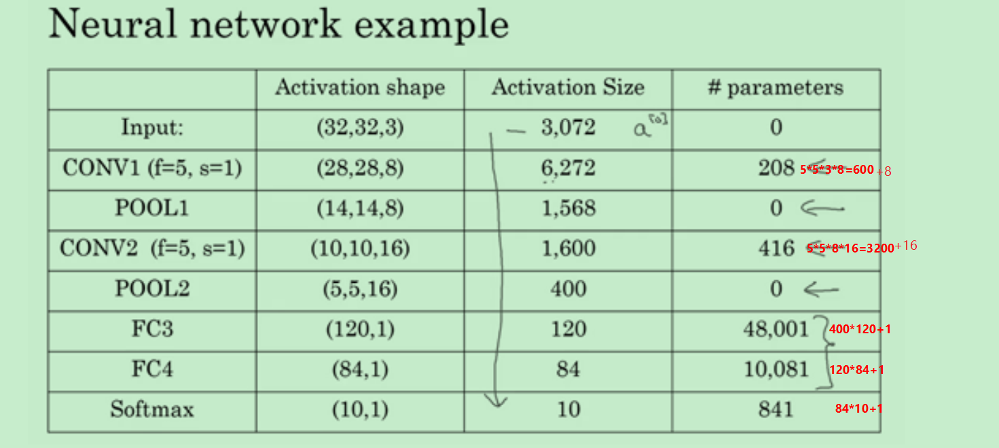

# 卷积神经网络

## 结构
卷积神经网络通常有三层结构：卷积层**CONV**, 池化层**POOL** 和全连接层**FC**

### 过滤器
过滤器一般分为两种 **valid** 和**same**

&#160; &#160; &#160; &#160;**valid** 过滤器会改变图像输出的维度， 假设图像维度为*n*,过滤器维度为*f*,过滤器步长为*s*, 图像边缘填充*p*维度则过滤后图像维度为
$$\frac{n+2p-f}{s}+1$$

&#160; &#160; &#160; &#160;**same** 过滤器会对边缘进行填充，以保持输出结果的维度与原始图像维度一直。这能够便秘图像边缘数据信息提取不充分

>当你的输入有特定的高宽和通道数时，你的过滤器可以有不同的高，不同的宽，但是必须**一样的通道数**。

> 一般过滤器的维度都是奇数的，这比较方便计算，而且奇数维度的过滤器中心比较确定。

&#160; &#160; &#160; &#160;通常我们会用多个过滤器来获取不同的特征，比如垂直边缘，水平边缘，倾斜边缘等待，过滤器本身参数很少，而图片的却很大。 这是卷积神经网络的一个特征，叫做“**避免过拟合**”
 
 > 卷积层主要用来提取不同维度的特征，池化层用来缩减模型的大小，提高计算速度，同时提高所提取特征的鲁棒性
 
#### 最大池化
**最大池化(max pooling)**, 就是用某个区域的最大值代替这个区域。

&#160; &#160; &#160; &#160;假如输入是一个 4×4 矩阵，执行最大池化的树池是一个 2×2 矩阵。执行过程非常简单，把 4×4 的输入拆分成不同的区域，我把这个区域用不同颜色来标记。对于2×2的输出，**输出的每个元素都是其对应颜色区域中的最大元素值**。

> 最大化操作的功能就是只要在任何一个象限内提取到某个特征，它都会保留在最大化的池化输出里。所以最大化运算的实际作用就是，如果在过滤器中提取到某个特征，那么保留其最大值。如果没有提取到这个特征，可能在右上象限中不存在这个特征，那么其中的最大值也还是很小，这就是最大池化的直观理解

池化超参数包括过滤器大小*f* 和步幅*s*,常用值为  
$$f = 2 , s=2 $$
效果相当于高度和宽度缩减一半。
    
    最大池化只是计算神经网络某一层的静态属性

## 卷积神经网络示例
假设输入大小为32*32*3 的图片，

    1. step 1 使用8个大小为5*5，步幅为1 的过滤器，则输出结果为28*28*8.
    2. 然后使用一个 f=2, s=2 的最大池化，输出结果进一步缩小为14*14*8

>这是神经网络的第一层，过滤器里面的所有参赛均需要深度学习，但是超参数不用。一层过滤器加一层池化，构成了一层神经网络

    3. step 2 使用16个大小为5*5，步幅为1 的过滤器，输出一个10*10*16 的矩阵
    4. 然后做最大池化， f=2, s=2 , 结果为5*5*16
 将输出结果平整化为大小为400 的一维向量，构建下一层
    
    5.构建一个输出为120维的全连接层， 权重矩阵维度为400*120
    6.构建一个输出为84位的全连接层， 权重矩阵为120*48
    7. 对这84个单元进行归一化进行识别
   手写数字识别神经网络结束

下面是各层的输入输出及需要学习的参数个数：
   

> 卷积层的优势在于**参数共享**和**稀疏连接**