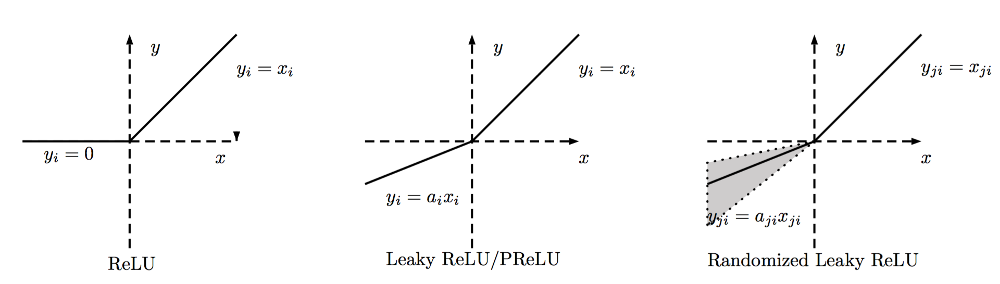

# softmax

[softmax](https://blog.csdn.net/bitcarmanlee/article/details/82320853)

$$S_{i}=\frac{e^{i}}{\sum_{j}e^{j}}$$
softmax=该元素的指数与所有元素指数和的比值
>其实softmax 就是求各个神经元得出的结果在各个分类上的比重。

对于一个神经网络，假定最后结果有**10**中分类结果。则神经网络在最后一层应该有**10**个单元，通过反复运算后运算结果被反映到这**10**个神经元上。

此时得到了包含**10**个维度的一组向量值，此时求得向量中各个元素的指数与所有元素指数和的比值， 并将最大比值所在单元作为预测结果(假定最大比值单元为**3**，则预测结果为第**3**中分类)。 这就是**softmax**

# ReLU
[为什么使用RELU](http://shuokay.com/2016/10/01/why-relu-work/)
$$ReLU(x)=\begin{cases}x, x>0 \\0, x\leq0\end{cases}$$

ReLU 通常用作激活函数，用来

*  克服梯度消失
*  防止过拟合
*  加快训练速度

## 激活函数
所谓激活函数，一般用在网络层之后，用作对网络层输出结果进行修正