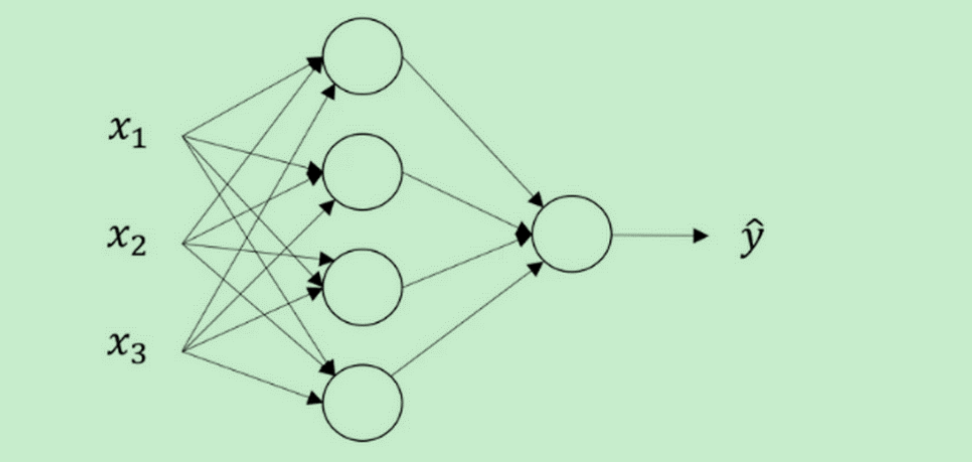
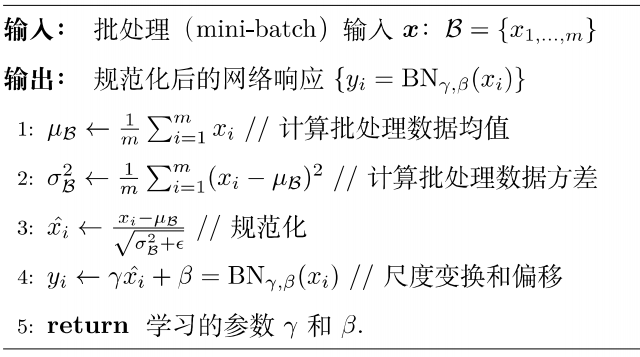

   
## 基本公式

$$\hat{y}=\mathrm{w}^{T}x + b$$
归一化
$$\sigma(\mathrm{z})=\sigma(\mathrm{w}^{T}x + b)=\frac{1}{1+e^{-\mathrm{z}}}$$
$$\hat{y}=\sigma{(\theta{^T}x)}$$

> 这是逻辑回归函数,控制结果落于目标区间

损失函数： Loss function:
$$L(\hat{y},y)= -y\mathrm{log}(\hat{y})-(1-y)\mathrm{log}(1-\hat{y})$$

对于多个数据时，数据格式为m*n ,即数据有m维，数据集有n个数据,则有：
$$Z=\mathrm{w}^{T}X + b$$
w 是 m*1 维矩阵，X为 m * n维矩阵, b 为实数
$$A=\sigma{(Z)}$$
>求Z 的偏导
$$dZ=A-Y$$
>求w 的偏导
$$dw=\frac{1}{m}*X*d\mathrm{z}^{T}$$
>求db 的偏导
$$db=\frac{1}{m}\sum(dZ)$$
>因此，可得梯度参数：
$$w:=w-\alpha*dw$$
$$b:=b-\alpha*db$$

通过不断迭代梯度参数，获取最终的w和b, 其中$\alpha$是迭代步长.

神经网络
---------------------------------

神经网络类似于这个样子：

隐层有4(自由设定)个单元，本身元素有3个维度

### 单个元素
-----------------------

因此第0层到第一层映射，有$W^{[0]}$是一个4*3 维的矩阵，$B$是一个4 *1的矩阵。此时则不对W进行转置，有
$$Z^{0}=W^{[0]}X+B^{[0]}$$
$Z^{[0]}$是一个4*n维的矩阵，每一列对应每一个数据的计算结果(结果是4个单元的)
通过 **sigmoid** 函数可以得到$A$ 即$A=\sigma(Z)$, $A$是一个4*N的归一化矩阵

第0层的输出作为第1层的输入，进行计算：
$$Z^{[2]}=W^{[2]}A^{[1]}+b^{[2]}$$
$$A^{[2]}=\sigma(Z^{[2]})$$
由于$A^{[1]}$ 是一个4*N矩阵，因此$W^{[2]}$是一个 1 *4的矩阵。从水平上看，矩阵$A$表了各个训练样本。从竖直上看，矩阵$A$不同的索引对应于不同纬度。

>总体上激活函数使用tanh 要优于**sigmoid**函数：
$$a=tanh(Z)=\frac{e^Z-e^{-Z}}{e^Z+e^{-Z}}$$
这主要是因为**tanh** 函数值域在-1~1之间，均值更接近于0，而**sigmoid**函数接近于0.5

>**tanh** 函数在所有场合都优于 sigmoid 函数。但有一个例外：在二分类的问题中，对于输出层，因为*y*值是 0 或 1，所以想让$\hat{y}$的数值介于 0 和 1 之间，而不是在-1 和+1 之间。所以需要使用**sigmoid**函数

> 因此可以对隐藏层使用**tanh**函数，对输出层使用**sigmoid**函数

### mini-batch 梯度下降法 
----------------------------------------------------
在对大数据进行梯度下降求导的时候，会因为数据量过大而导致训练缓慢。可以对数据进行拆分。

例如500万的数据集，我们可以拆分成5000个包含1000个数据的数据集合。使用 batch 梯度下降法，一次遍历训练集只能让你做一个梯度下降，使用 mini-batch 梯度下降法，一次遍历训练集，能让你做 5000 个梯度下降。当然正常来说你想要多次遍历训练集，还需要为另一个 while 循环设置另一个 for 循环。所以你可以一直处理遍历训练集，直到最后你能收敛到一个合适的精度。

#### Z的规范化
-------------------------------------------------
> [规范化参考](https://www.cnblogs.com/skyfsm/p/8453498.html)

假定有个数据规模为m的数据集，对于任意一个隐藏层，都会获取到自个的$Z^{i},i \epsilon(1,m)$,对z进行规范化：

在各个隐层进行的规范化与上式差不多，只不过是针对Z 进行规范化。
> $$\begin{matrix}\mu=\frac{1}{m}\sum_{i-1}^mZ^{(i)}\end{matrix}$$

> $$\sigma$$

